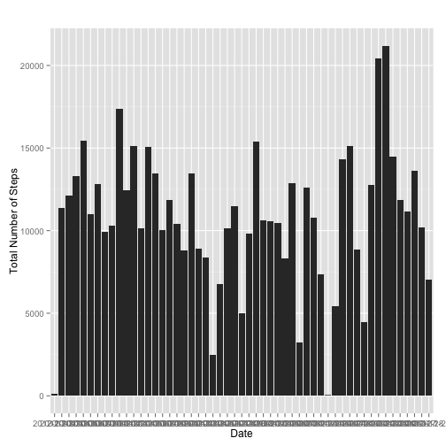
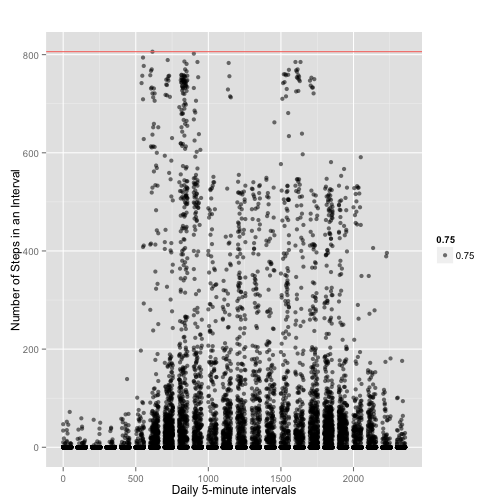
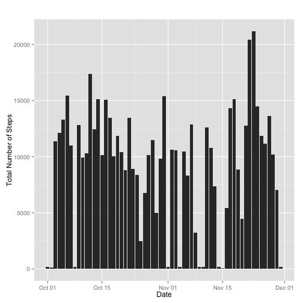
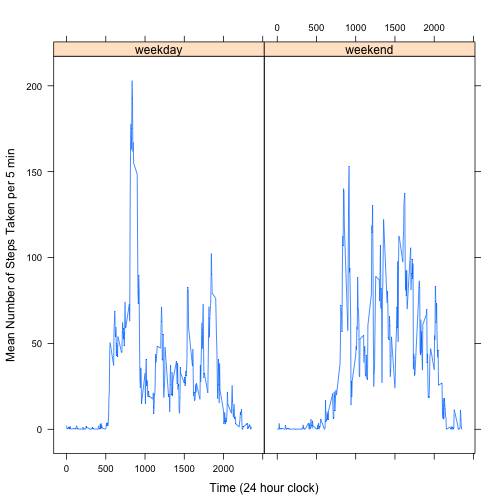

## Libraries


```r
library(dplyr)
library(ggplot2)
library(lattice)
```

## Loading and preprocessing the data
    This assignment makes use of data from a personal activity monitoring device. This device collects data at 5 minute intervals through out the day.  The data for this assignment can be downloaded from the course web site, or
the GitHub repository also contains the dataset for the assignment so you do not have to download the data separately.:

    Dataset: [Activity monitoring data](https://d396qusza40orc.cloudfront.net/repdata%2Fdata%2Factivity.zip) (52K)

    The variables included in this dataset are:

    * steps: Number of steps taking in a 5-minute interval (missing values are coded as NA)

    * date: The date on which the measurement was taken in YYYY-MM-DD format

    * interval: Identifier for the 5-minute interval in which measurement was taken


```r
## Zipped data file is part of forked repository, so don't need to download it 
#fileUrl <- "https://d396qusza40orc.cloudfront.net/repdata%2Fdata%2Factivity.zip"
#download.file(fileUrl,destfile="activity.zip",method="curl")

unzip("activity.zip")  
df <- read.csv("activity.csv")

message('Original size of data')
```

```
## Original size of data
```

```r
str(df)
```

```
## 'data.frame':	17568 obs. of  3 variables:
##  $ steps   : int  NA NA NA NA NA NA NA NA NA NA ...
##  $ date    : Factor w/ 61 levels "2012-10-01","2012-10-02",..: 1 1 1 1 1 1 1 1 1 1 ...
##  $ interval: int  0 5 10 15 20 25 30 35 40 45 ...
```

```r
#get rid of NaNs
df_clean <- df[complete.cases(df), ]

message('Cleaned size of data')
```

```
## Cleaned size of data
```

```r
str(df_clean)
```

```
## 'data.frame':	15264 obs. of  3 variables:
##  $ steps   : int  0 0 0 0 0 0 0 0 0 0 ...
##  $ date    : Factor w/ 61 levels "2012-10-01","2012-10-02",..: 2 2 2 2 2 2 2 2 2 2 ...
##  $ interval: int  0 5 10 15 20 25 30 35 40 45 ...
```

## Latex's definition of mean(x), because I want to see that Latex works.
The arithmetic mean is equal to $\frac{1}{n} \sum_{i=1}^{n} x_{i}$.

## What is mean total number of steps taken per day?
For this part of the assignment, you can ignore the missing values in the dataset.

    * Make a histogram of the total number of steps taken each day

    * Calculate and report the mean and median total number of steps taken per day


```r
df$date <- as.POSIXct(df$date)   # convert sytle of date

df_clean  %>%  group_by(date) %>%    
 			summarise(totSteps=sum(steps)) -> df_byDates

ymax = max(df_byDates$totSteps)
```

Now for the plot.


```r
   # echo=TRUE breaks the plot. Error in R markdown.

qplot(date, totSteps, data=df_byDates, 
    geom = "histogram",
    stat="identity",
    xlab="Date", ylab="Total Number of Steps",
    ylim = c(0, ymax),
	main="")
```

 

* Mean number of steps per day is 1.0766189 &times; 10<sup>4</sup>.

* Median number of steps per day is 10765.


## What is the average daily activity pattern?

    * Make a time series plot (i.e. type = "l") of the 5-minute interval (x-axis) and the average number of steps taken, averaged across all days (y-axis)

    * Which 5-minute interval, on average across all the days in the dataset, contains the maximum number of steps?


```r
df_clean  %>%  summarise(meanSteps=mean(steps)) -> interval_mean

df_clean  %>%  group_by(interval) %>%    
         	summarize(meanSteps=mean(steps)) -> df_byIntervals
df_clean  %>%  group_by(interval) %>%    
         	summarize(maxSteps=max(steps)) -> df_maxByIntervals


whichMax <- which.max( df_maxByIntervals$maxSteps )  # index of the max
```
*The interval at 375 to 380 minutes has 
the maximum number of steps (63.4528302), 
assuming averaged across all the days in the dataset.*


```r
qplot( interval, steps, data=df_clean, 
    alpha = 0.75, 
    type = 'l',   # line type
    xlab="Daily 5-minute intervals", ylab="Number of Steps in an Interval",
    # ylim = c(0, ymax),
    main="") +
    geom_hline(aes(yintercept=df_maxByIntervals$maxSteps[whichMax], 
                        color="orange"))
```

 

## Imputing missing values
    Note that there are a number of days/intervals where there are missing values (coded as NA). The presence of missing days may introduce bias into some calculations or summaries of the data.

    -    Calculate and report the total number of missing values in the dataset (i.e. the total number of rows with NAs)

    -    Devise a strategy for filling in all of the missing values in the dataset. The strategy does not need to be sophisticated. For example, you could use the mean/median for that day, or the mean for that 5-minute interval, etc.

    -    Create a new dataset that is equal to the original dataset but with the missing data filled in.

    -    Make a histogram of the total number of steps taken each day and Calculate and report the mean and median total number of steps taken per day. Do these values differ from the estimates from the first part of the assignment? What is the impact of imputing missing data on the estimates of the total daily number of steps?

*I calculate the number of rows with missing values (NA) as 
2304 out of 17568 original rows*, which is 
13.1147541%.

 As for a strategy to fill up missing data, it is generally A BAD IDEA!
 It is extrapolation, at best. One might put in FAKE data based on what 
 you might expect to find, say the average value, or a low baseline like times of low activity. Low activity might be occasional squirming while sleeping which might get recorded as a few steps, or recordings while watching a movie. Which (average or baseline) is a better might depend on what time of day the missing records are.  Actually, if one is good at Bayesian analysis, I would bet that the baseline would be a good choice of prior and that the missing data can just be ignored. So to be contrarian, *I chose to use the average from midnight to 5 AM to (under protest) fill up the missing data.* 
 

```r
df_clean %>%  summarise(meanSteps=mean(steps[interval<500])) -> 
    steps_baseline

df_clean %>%  summarise(meanSteps=mean(steps)) -> 
    steps_mean

# get number from data frame wrapper.
meanNight <- steps_baseline$meanSteps[1]
mean24hr <- steps_mean$meanSteps[1]


df -> df_impute
# replace NA's with value steps_baseline
df_impute$steps[is.na(df_impute$steps)] <- meanNight
```

 *I replace the missing values with a value of 0.658805*
 This corresponds to a mean number of steps per interval between midnight and 5 AM 
 (500 on the graph's x axis) of 0.658805,
 compared to an overall mean of 37.3825996. 
 Only 2/3's of a step per interval during the nighttime hours. Very small!


```r
df_impute  %>%  group_by(date) %>%    
     		summarise(totSteps=sum(steps)) -> df_imputeByDates
```


```r
qplot(date, totSteps, data=df_imputeByDates, 
    geom = "histogram",
    stat="identity",
    xlab="Date", ylab="Total Number of Steps",
    ylim = c(0, ymax),
    main="")
```

 


```r
mean_percentChange <- 100*
    (mean(df_imputeByDates$totSteps) - mean(df_byDates$totSteps)) / 
    mean(df_byDates$totSteps)

median_percentChange <- 100*
    (median(df_imputeByDates$totSteps) - median(df_byDates$totSteps)) / 
    median(df_byDates$totSteps)
```

* Imputed data: Mean number of steps per day is 9379.1128982;  cleaned, unimputed mean was 1.0766189 &times; 10<sup>4</sup>.  By filling missing data, the mean has changed by -12.8836288 percent.

* Imputed data: Median number of steps per day is 1.0395 &times; 10<sup>4</sup>; cleaned, unimputed median was 10765.  By filling missing data, the median has changed by -3.4370646 percent.

Note: Since I filled missing data with a low estimate, the changes in the
mean and median are probably exaggerated compared to using the mean or median for the filling value. 


## Are there differences in activity patterns between weekdays and weekends?
    For this part the weekdays() function may be of some help here. Use the dataset with the filled-in missing values for this part.

    Create a new factor variable in the dataset with two levels – “weekday” and “weekend” indicating whether a given date is a weekday or weekend day.

    Make a panel plot containing a time series plot (i.e. type = "l") of the 5-minute interval (x-axis) and the average number of steps taken, averaged across all weekday days or weekend days (y-axis). See the README file in the GitHub repository to see an example of what this plot should look like using simulated data.
    
    For this part the `weekdays()` function may be of some help here. Use the dataset with the filled-in missing values for this part.

    1. Create a new factor variable in the dataset with two levels -- "weekday" and "weekend" indicating whether a given date is a weekday or weekend day.

    1. Make a panel plot containing a time series plot (i.e. `type = "l"`) of the 5-minute interval (x-axis) and the average number of steps taken, averaged across all weekday days or weekend days (y-axis). The plot should look something like the following, which was created using **simulated data**:
    
    (Plot was here)

    **Your plot will look different from the one above** because you will be using the activity monitor data. Note that the above plot was made using the lattice system but you can make the same version of the plot using any plotting system you choose.

    


```r
weekwhat <- weekdays(as.Date(df_impute$date))
df_impute$weekCat <- factor(rep(NA, length(nrow(df_impute)) ), 
                 levels=c("weekday", "weekend") )
df_impute$weekCat[ weekwhat %in% c("Saturday", "Sunday")] <- "weekend"
df_impute$weekCat[ is.na(df_impute$weekCat) ] <- "weekday"

df_impute  %>%  group_by(interval, weekCat) %>%    
             summarize(meanSteps=mean(steps)) -> df_imputebyIntervals
```


```r
xyplot(
    df_imputebyIntervals$meanSteps ~ df_imputebyIntervals$interval |df_imputebyIntervals$weekCat,
    type = 'l',   # line? type
    xlab = 'Time (24 hour clock)', 
    ylab = 'Mean Number of Steps Taken per 5 min' 
    )
```

 
